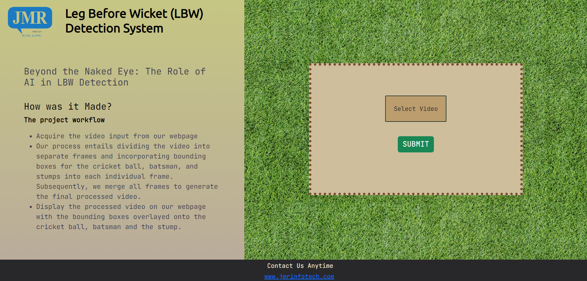
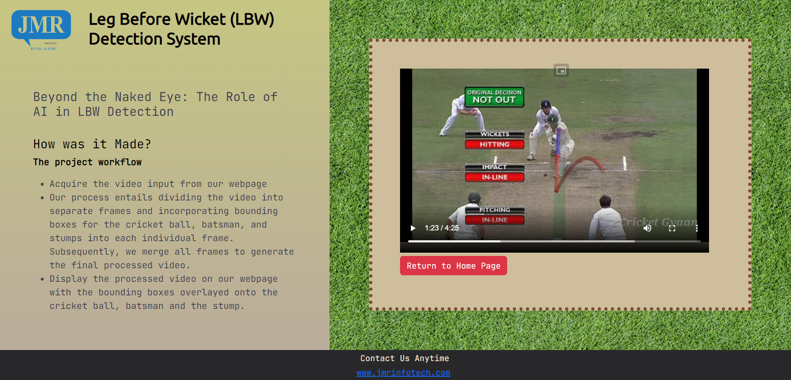

# Cricket DRS Ball tracker 

## Problem Statement  

##### "Track and predict the ball in cricket pitch right from the release action of the bowler's hand to hitting the batsman bat/pad or stumps. A video of the ball thrown at the pitch will bbe given as an input to detect & track the ball movement."

## Solution Overview

##### The solution developed to address the problem statement involved the following steps:
 
+ **Creating an optimal project workflow**
  + Acquire the video input from our webpage
  + Our process entails dividing the video into separate frames and incorporating bounding boxes for the cricket ball, batsman, and stumps into each individual frame. Subsequently, we merge all frames to generate the final processed video.
  + Display the processed video on our webpage
+ **The AI aspect of the project**
  + Made using **Python** and its corresponding libraries
  + Our first step is to retrieve the video input from the designated directory
  + Next, in order to feed the video input into our transformer, we needed to preprocess the data. To accomplish this, we utilized **OpenCV** to divide the video into individual frames, and applied a center crop to extract the relevant segments of the video. Subsequently, we fed each of these frames into our model one by one.
  + Our (model) employs (deep learning) to produce the coordinates of the cricket ball, batsman, and stumps for each individual frame. Subsequently, we overlay bounding boxes onto each set of generated coordinates within their corresponding frames. Finally, we integrate all the adjusted frames to generate the desired processed video that enables the tracking of the cricket ball.
  + We upload the processed video to its designated directory
+ **UI/UX aspect of the project**
  + Consists of two parts-> **Frontend** and **Backend**
  + **Frontend:**
    + A simple frontend made using **HTML,CSS and Bootstrap**
  + **Backend**
    + A backend made using **Flask and Python**
    + Receives a video file input and saves it in the designated directory for processing by our model.
    + Displays the processed video file from its designated directory on the website
### GUI Prototypes
#### The web app provides a user-friendly interface that allows you to upload a video of a potentially dubious LBW decision. Once uploaded, the video is processed, and a bounding box is generated around the ball, which is then played back to you.

#### Once we have uploaded the required video, we can click on "Submit" to initiate the video processing. Once the processing is complete, the video will be displayed on the following screen.

